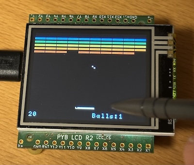

# Breakout
A fun retro game is breakout. I had it on my Apple's in BASIC, Pascal and Forth. I like to use it on forthcoming embedded designs, like a command line option in Zephyr or just any embedded system with a display (as an easter egg)

But first from the archive. I kept a `brickles.pas` listing. It was a leftover from my period I used the **Apple //gs** and programmed using Pascal.

I scanned the listing from the paper and I have included the original **Pascal** source code in this repository. Then with help of Claude AI, I turned the Pascal code into MicroPython code. 

## Brickles 2026
The **micropython** version uses an ADC input for the **paddle**. The size of the display could be `128×64`, `240×240` and `320×200`. Even the original **LCD160**, size `160x128`, that came with the first PYBOARDs is supported. The LC160 also features a touch screen, so no paddle or switch to connect.

The implementation is in two files. When using a generic SPI/I2C screen with a frame buffer you can use [`brickles.py`](src/brickles.py). When the LCD160 is used, both `brickels.py` and [`brickels_pyb.py`](src/brickles_pyb.py) are needed. Use `brickels_pyb.py` to start the game instead.

The touch screen can be turned off by setting `run()` empty or `run(touch=False)`. In that case the **ADC** input and the **USR switch** are used instead as for all other display variations.

## Disclaimer
The code provided, as is, serve learning purposes. I rather dare you to write an original game yourself instead of having **AI** do it for you.

This code has been generated from the original Pascal source which was scanned from paper. With a lot of instructions on how and what was required the generated outcome delivers working code. It is amazing. But are we generating technical debt?

For now I use AI as a tool to sample my ideas. The speed of putting ideas to working prototypes is amazing.

> "Don’t fear the machine. Fear the people who use it.”
