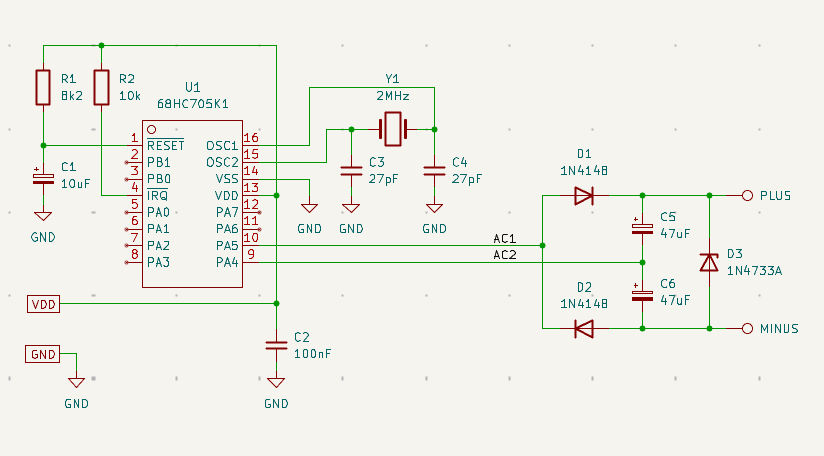

# Charge Pumps

A charge pump, as the name says, pumps charge into a capacitor. This can be acomplished in different ways.

When building some analog circuit , it could happen that a negative voltage is necessary to power an Op-Amp. It would only be a few milli-ampere that are needed. That's where a charge pump can be of help. 

## Retro pump


> This Design Idea is given new life just to honor the engineers from the past! 

An old idea of such a charge pump was published way back in EDN on August 1, 1997 to be precise.  



### Listing

The old idea was implemented on a 68HC05 by alternating two I/O pins at 500Hz, something that nowadays with complex timers and PWM can be performed without processor intervention or just use a dedicated IC.

The nice thing about those "un-regulators" that are driven by a few I/O pins, is the relative simple implementation at almost zero cost.

```
*
* MC68HC05 ASSEMBLY CODE FOR CHARGE-PUMP BACKGROUND TASK
*
* This sample program demonstrates how to build a cheap charge-pump
* embedded in a microcontroller system as a background task done in
* software.

#BASE	$0A

MOR 	EQU		$0017	; Mask Option Register
RAM 	EQU		$00E0	; Beginning of RAM memory
ROM		EQU		$0200 	; Beginning of ROM memory
VECTORS	EQU		$03F8	; Interrupt vectors

DRA 	EQU 	$0000	; Port A Data Register
DDRA 	EQU 	$0004	; Port A Data Direction Register
ISCR 	EQU 	$000A	; IRQ Status and Control Register
IRQE 	EQU 	7 		; External interrupt request enable
TSCR 	EQU 	$0008	; Timer Status and Control Register
TOFR 	EQU 	3		; Timer Overflow Flag Reset

AC1 	EQU 	5 		; Charge-pump AC input 1
AC2		EQU 	4 		; Charge-pump AC input 2

***********************
* MOR byte definition *
***********************
		ORG 	MOR
		FCB 	$00 	; COP watchdog disabled

***********************
* Program definition  *
***********************
		ORG 	ROM
		BSET 	AC1, DDRA	; AC1 pin as output
		BSET 	AC2, DDRA	; AC2 pin as output

		BSET 	AC1,DRA 	; AC1 set to VDD (on ~3V)
		BCLR	AC2,DRA 	; AC2 set to GND (off)

		BCLR 	IRQE,ISCR 	; Disable IRQ interrupts

		LDA 	#%00100000	; Timer overflow interrupt enabled
							; RTI interrupt disabled
		STA 	TSCR 		; Make it so
		CLI 				; Enable interrupts 

MAIN:	EQU 	* 			; Enter your application from this point forward
		BRA 	MAIN

************************************
* Timer Overflow Interrupt Service *
* Routine executed every 1 msec    *
************************************
CHARGE:
		BSET 	TOFR,TSCR	; Reset Timer Overflow interrupt
		LDA 	DRA 		; Get last output latch
		EOR 	#%00110000 	; Complement values of AC1 & AC2
		STA 	DRA 		; Update signal (frequency 500 Hz)
DUMMY:
		RTI

***********************
* Interrupt Vectors   *
***********************
		ORG 	VECTORS

		FDB		CHARGE 	; RTI vector
		FDB		DUMMY 	: IRQ vector
		FDB		DUMMY	; SWI vector
		FDB		MAIN	; RESET vector

		END
```


## Integrated Circuits

### Texas Instruments blog and info on charge pumps.

With no microcontrollers involved, but basic analog power supply design, these articles are of interest.

[The Forgotten Convertor](https://www.ti.com/lit/wp/slpy005/slpy005.pdf)

[charge pump part 1](https://www.ti.com/lit/ta/ssztbo1/ssztbo1.pdf?ts=1785988532185)

[charge pump part 2](https://www.ti.com/lit/ta/ssztbk7/ssztbk7.pdf?ts=1786007947653)

[pump it up quietly](https://www.ti.com/lit/ta/ssztbl9/ssztbl9.pdf?ts=1786042007396)

