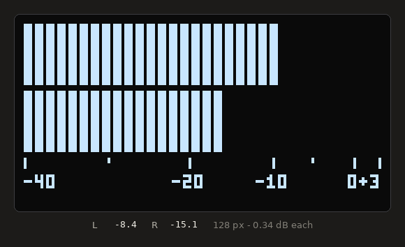
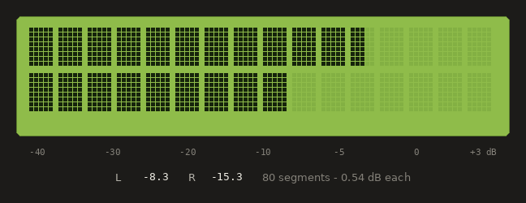

# VU Meter

**Concept of a VU meter using two types of displays.**

[Graphical display](src/sh1106_vu.c) acting as a VU-meter:

[Alpha-numeric](src/hd44780_vu.c) display acting as a VU-meter:

## Disclaimer

The code provided, as is, serve learning purposes and is not fit, tested or recommended for production code. I try to limit the technical debt!

This code has been generated using Claude AI. It is used as prototype/demo software.

I use AI as a tool to sample my ideas. The speed of putting ideas to working prototypes is amazing.
